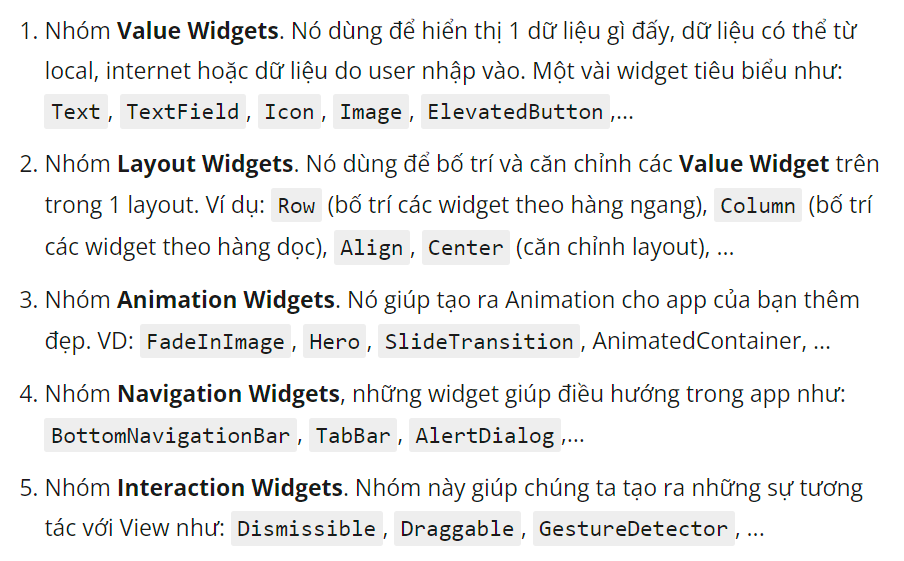

## LAYOUT BASE


## WIDGET BASE




## truyền dữ liệu

### globalKey

A. widget cha:

```agsl
    final _key = GlobalKey<nameStateWidgetChild>();
    ...
    fun(){
        _key.currentState?.nameFunUpdate(value);
    }
    return 
        ...
        MusicsSection(key: _key)
```

B. widget con:

```agsl
    class nameWidgetChild extends StatefulWidget {
        MusicsSection({Key? key}) : super(key: key);
        ...
    }
    
    class nameStateWidgetChild extends State<nameWidgetChild> {
          nameFunUpdate(varType newValue) {
            setState(() {
              var = newValue;
            });
          }
    }
```

### callback

A. widget cha:

```agsl
    return
        nameWidget(
            data: data,
            nameFun() { ... }
        )
```

B. widget con:

```agsl
    class nameWidget extends StatefulWidget{
        final data;
        final Funtion fun;
        nameWidget2({required this.data, required this.fun});
    }
    
    class nameWidgetStatus extends Status<nameWidget>{
        //gọi ra data
        widget.data
        //gọi fun
        fun()
    }
```


